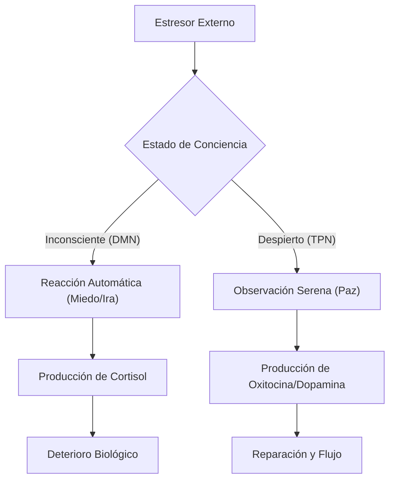

Capítulo 15: Los Frutos de la Conciencia Despierta: Cosechando tu Nueva Realidad

---

Muy buenos días.

A lo largo de este libro, hemos trabajado la tierra de tu interior con una intención y una disciplina que pocos se atreven a sostener. Hemos bajado a las profundidades de la sala de máquinas para reprogramar el subconsciente; hemos calmado la tormenta química de tu sistema nervioso nutriéndolo con coherencia, y hemos afinado tu frecuencia vibratoria con la precisión de un maestro luthier. Pero quizás, mientras sudabas en el gimnasio del alma, te has hecho la pregunta inevitable: *¿Para qué tanto esfuerzo? ¿Cuál es la recompensa real de este compromiso innegociable con vivir despierto?*

Déjame decirte algo que transformará tu perspectiva para siempre: el viaje del despertar no es una búsqueda mística sin puerto, ni un sacrificio moral para ganar un cielo lejano. Es, en su esencia más pura, el proceso de **recordar y regresar a la plenitud**. No estás intentando "convertirte" en alguien superior; estás desmantelando las capas de escombros, miedos y etiquetas que impedían que tu verdadero resplandor —lo que realmente eres— brillara con libertad.

Hoy comenzamos la gran cosecha. Los frutos de la conciencia despierta no son promesas abstractas para una vida futura; son realidades biológicas, psicológicas y energéticas que florecen en el **aquí y el ahora** de quien practica con constancia. Son las pruebas de que vivir en modo consciente no es una teoría bonita, sino un experimento vital exitoso que rediseña tu forma de habitar el universo.

---

1. La Paz Inamovible: La Biología del Testigo

El fruto más sagrado y fundamental de este proceso es una paz que el mundo no puede darte y, por lo tanto, tampoco puede quitarte. No estamos hablando de esa "paz frágil" que solo aparece cuando todo afuera está en orden. Estamos hablando de una **Paz Inamovible**, la paz del "Testigo Silencioso" o del Observador.

El Salto del DMN al TPN
Desde la neurociencia moderna, esta paz tiene una explicación fascinante. Un cerebro no entrenado vive la mayor parte del tiempo en la **Red Neuronal por Defecto (Default Mode Network - DMN)**, asociada con el pensamiento autorreferencial y la ansiedad. Al practicar la conciencia despierta, activas la **Red de Tarea Positiva (Task Positive Network - TPN)**, el estado de presencia absoluta.

2. La Alquimia de las Emociones: De la Reacción a la Transfiguración

La conciencia despierta no suprime tus emociones; las libera de la carga del ego. Ya no eres la víctima de tus estados de ánimo; eres su observador compasivo.

Las Nubes en el Cielo de la Conciencia
Imagina tu conciencia como el cielo azul, vasto e infinito. Las emociones —la tristeza, el miedo, la ira— son simplemente nubes que pasan. Tú eres el cielo; ninguna nube puede definir el clima permanente de tu ser. Las emociones vienen, te entregan un mensaje químico necesario, y si no te resistes, fluyen y se disipan naturalmente.

3. La Inteligencia del Corazón: El Despertar de la Intuición

Cuando el parloteo incesante del ego finalmente se aquieta, emerge la voz de tu **Intuición**. Tu mente consciente deja de ser un amo tiránico y se convierte en una herramienta precisa al servicio de tu ser superior.

Al vivir en coherencia, el "cerebro del corazón" envía señales prioritarias a tu cabeza. Las decisiones pierden su peso de ansiedad. No necesitas analizar hasta el agotamiento cada pros y contra, porque experimentas un "conocimiento directo". Las corazonadas se vuelven nítidas y la niebla de la confusión se disipa.

4. Relaciones Conscientes: El Fin del Amor por Necesidad

Al dejar de proyectar tus heridas en los demás, tus vínculos se transforman. El amor deja de ser una "búsqueda de llenado" y se convierte en una **expresión de plenitud compartida**.

| Atributo | Relación Inconsciente (Ego) | Relación Consciente (Ser) |
| :--- | :--- | :--- |
| **Motivación** | Necesidad de ser completado | Deseo de compartir plenitud |
| **Comunicación** | Manipulación y Juicio | Autenticidad y Empatía |
| **Límites** | Miedo al abandono / Control | Respeto soberano y Libertad |
| **Conflicto** | Ataque y Defensa | Oportunidad de Crecimiento |

5. El Estado de Flow y la Co-creación Cuántica

Toda la energía que antes desperdiciabas en luchar contra ti mismo ahora se libera. Esa energía se convierte en una **fuerza creativa bruta**. 

Empiezas a experimentar estados de *Flow* (flujo). La vida comienza a sentirse como una danza mágica con el universo, donde las **sincronicidades** —esos encuentros casuales perfectos— se vuelven la norma. Ya no empujas la vida; navegas con la corriente del cosmos.

6. El Gozo del Servicio: Tu Propósito como Estado de Ser

El fruto final es la disolución de la ilusión de la separación. Surge un deseo natural de contribuir. Este servicio nace de un **gozo expansivo**. Te reconoces en el otro, y al aliviar su sufrimiento, te estás sanando a ti mismo. Tu sola presencia se transforma en una invitación silenciosa para que otros recuerden su propia luz.

---

🚀 Tu Sección de Acción: La Celebración de la Cosecha

Ejercicio 1: El Diario de los Frutos Cuánticos
Anota cada noche:
1.  **Paz en el Conflicto**: ¿Cuándo fuiste el Observador hoy?
2.  **Señal de la Intuición**: ¿Qué "saber directo" recibiste?
3.  **Sincronicidad Detectada**: ¿Qué casualidad perfecta ocurrió?
4.  **Alegría sin Motivo**: ¿En qué momento sentiste el gozo de existir?

Ejercicio 2: El Acto de Compasión Radical Anónima
Realiza una acción para elevar el día de alguien hoy en absoluto secreto. Observa cómo el ego intenta "contarlo" y elige el silencio.

Ejercicio 3: Meditación del Océano
Siéntate 10 minutos. Visualiza tu conciencia como un océano profundo. Baja mentalmente al fondo, donde todo es quietud. Las olas de pensamientos están arriba; tú estás en el silencio abisal.

---

💡 Frase para recordar

> **"Tú no estás buscando la luz; te habías olvidado de que eres el lugar donde la luz brilla."**

---

🌟 Antes de pasar al Capítulo 16...

Recoger tus frutos es un acto de gratitud. Estos resultados son el indicador de que estás alineado. Pero recuerda: la conciencia despierta es un viaje dinámico. Por eso, en el próximo capítulo, aprenderemos sobre **Mantener el Equilibrio**: Cómo navegar los procesos de expansión y contracción sin perder tu centro.

**El viaje es la recompensa. Nos vemos en el Capítulo 16.**
